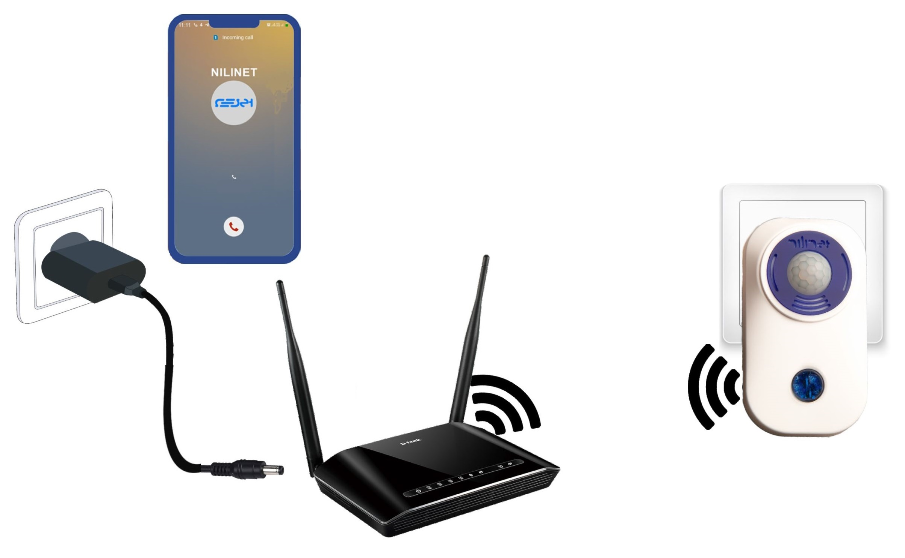

# IOT-Security-Gadget-Based-on-ESP32

<div align="center"><a href="#"></a><br></div>
<br/>
IoT security gadget based on ESP32 is a smart security system designed to detect any unauthorized entry into a place and alert the homeowner via MQTT Protocol  and call to their mobile phone. The system is built using an ESP32 microcontroller, a PIR sensor, an internal battery and Tasmota firmware.


<br/>
<br/>

<div align="center"><a href="#"></a><br></div>
<br/>


ESP32 is a powerful microcontroller that's commonly used in IoT projects due to its low cost, low power consumption, and built-in Wi-Fi and Bluetooth connectivity. The ESP32 can be used to process data from various sensors and modules, making it a perfect choice for a home security system. [refrence](https://github.com/espressif/arduino-esp32)

Tasmota firmware is an open-source firmware for ESP8266 and ESP32-based devices that provides a web interface for configuration and control of the device. It's designed to be easy to use and highly configurable, making it a popular choice for DIY IoT projects. [refrence](https://github.com/arendst/Tasmota)

The PIR sensor is a motion sensor that detects changes in infrared radiation in its field of view. When an intruder enters the field of view, the PIR sensor detects the movement and sends a signal to the ESP32 microcontroller.

The ESP32 microcontroller can process the data from the PIR sensor and trigger various actions and alerts based on the data. For example, when the PIR sensor detects motion, the system can send an alert to the user's smartphone or trigger an audible alarm.

To power the system, an internal battery can be used. The internal battery is a rechargeable battery that's built into the system, providing power to the system for an extended period, even if there's a power outage.
<br/>
<br/>

<div align="center"><a href="#"></a><br></div>

<br/>
The system can also be integrated with other smart home devices, such as smart lights and smart locks. This allows the user to control the security system and other smart home devices from a single interface.

Overall, an IoT security gadget based on ESP3 and Tasmota is a simple yet effective solution for detect any unauthorized entry into a place even during power outages.

### This project has been tested more than 8000 hours...


## Animated description of the project
<br/>
<br/>
<div align="center"><a href="#"></a><br></div>
<br/>
<br/>

## Application

This IoT mobile app is built with JavaScript and MQTT protocol and is designed to communicate with IoT devices in a network using the MQTT protocol to exchange data. The app is specifically built for Android platforms using JavaScript and can run on various Android devices.

The MQTT protocol is a lightweight messaging protocol that's commonly used in IoT applications. It's designed for low-bandwidth, high-latency networks and can handle a large number of devices simultaneously. The MQTT protocol allows IoT devices to communicate with each other and with the app, exchanging data in real-time.

<br/>
<div align="center"><a href="#"></a><br></div>

<br/>

### For more information and download :  [Google Play](https://play.google.com/store/apps/details?id=tg.nilinet.starter&hl=en_US&gl=US)


## Features

-  Tasmota firmware:
    -  Tasmota firmware is an open-source firmware for ESP8266 and ESP32-based devices that provides a web interface for configuration and control of the device. It's designed to be easy to use and highly configurable, making it a popular choice for DIY IoT projects. [refrence](https://github.com/arendst/Tasmota)

-  PIR Sensor:
    -  The PIR sensor is a motion sensor that detects changes in infrared radiation in its field of view. The ESP32 microcontroller can process the data from the PIR sensor and trigger various actions and alerts based on the data.
      
-  Internal battery:
    -  The internal battery is a rechargeable battery that's built into the system, providing power to the system for an extended period, even if there's a power outage.

 -  External USB port:
    -  USB port for connecting all types of internet modems that have 5V power supply.

 -  IOT:
    -  Sending and receiving information with the MQTT protocol for any device or person.

 -  Call:
    -  Sending calls to mobile phones through the server.
      
<br/>

## Tasmota and software

### For more information, Tasmota and scripts ```Src/COM.ino```


## License
[MIT License](LICENSE)

Free Hardware!

